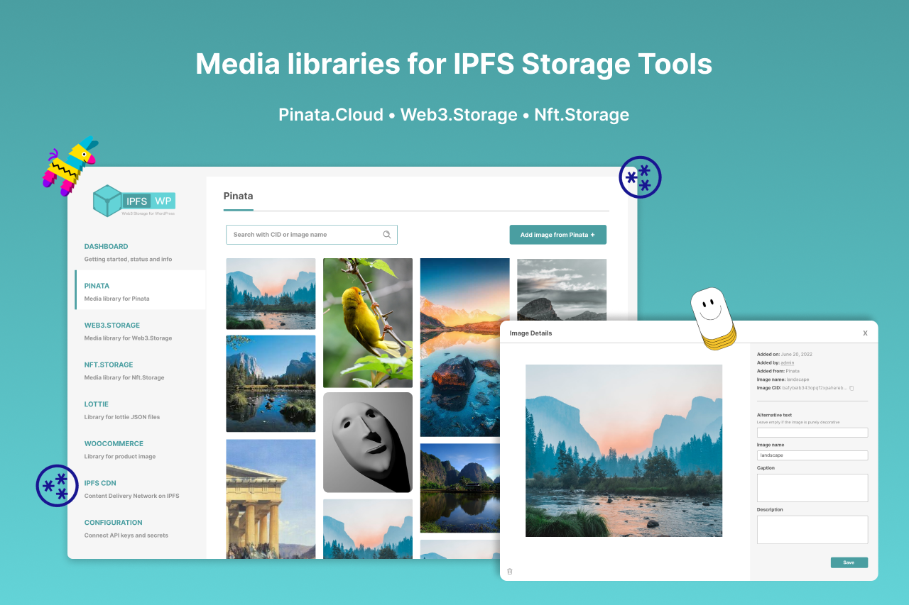

    
    <h1>IPFS for WordPress</h1>
    <strong>The all-in-one plugin that provides powerful & comprehensive IPFS solutions for WordPress CMS.</strong>

 

## Features Overview

Here is a **features overview (TL;DR)**  of the "IPFS for WordPress" plugin:

* APIs support for IPFS storage tools
* Media libraries for IPFS storage tools
* On-the-spot upload & retrieve for IPFS storage tools
* Lottie animation support for IPFS
* Elementor addons for IPFS integrations
* IPFS integration for WooCommerce
* IPFS image generation system
* IPFS Content Delivery Network (ICDN) for WordPress 

### ✔️ APIs support for IPFS storage tools

Users can choose which IPFS storage tools to use by enabling them in the configuration tab of their plugin admin panel, and easily connect their IPFS storage tools with the help of APIs keys and secrets created from their storage tools account. The dashboard of the plugin will also display the APIs connection status of their IPFS storage tools. Users can now easily set up the plugin and are ready to use all the IPFS features just with a few simple configuration steps. With the APIs support, media assets and files can be seamlessly retrieved from users' IPFS storage tools (IPFS network) and also able to upload anything with one click. Every feature of the plugin will be hassle-free with the APIs support, and users can just focus on their integration, site-building as well as all the IPFS tasks in one place, which is WordPress.

### ✔️ Media libraries for IPFS storage tools

Every IPFS storage tool (Pinata, Web3.Storage, Nft.Storage) will have its own individual media library and be able to access all of them in the plugin admin panel. In other words, when users retrieve images from IPFS storage tools, the images will be added to the respective media library and can be easily managed. Worth mentioning that the media retrieving process is just a few simple clicks and your IPFS-retrieved images are ready to use on your WP site. Not only displaying the images retrieved from the IPFS storage tools, but users can also edit the image details with our image lightbox editor, and apply SEO to the IPFS-retrieved image assets. Furthermore, by toggling on the IPFS image block (Elementor addons) at the dashboard, users can now easily use their IPFS-retrieved images on their WP site with the help of the popular WordPress website builder, Elementor.

